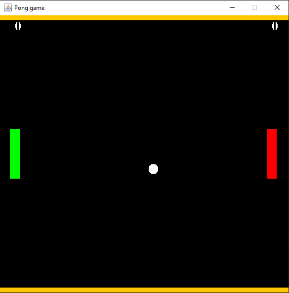

# Pong-JavaGame
A minimal GUI java retro pong game
 
### Languages & tools :
[][java]
[][java]
  

|Java Pong Game|
|------|
||

### Directory Structure :
    |-- Pong(minimal)-java
    |    |-- out
    |    |
    |    |-- src
    |    |   |-- com
    |    |       |-- Game
    |    |           |-- GameLogic.java
    |    |           |-- Main.java
    |    |
    |    |-- Pong.iml
    |    |-- Pong(minimal)-java.iml
    |    |-- README.md
    |
    |-- Img
    |    |-- java.png
    |    |-- intellij.png
    |    |-- javaPong1.png
    |
    |-- README.md
### Connect with me :  

  
 

[website]: https://abhilashtuofficial.github.io/
[java]: https://github.com/AbhilashTUofficial/java-programming